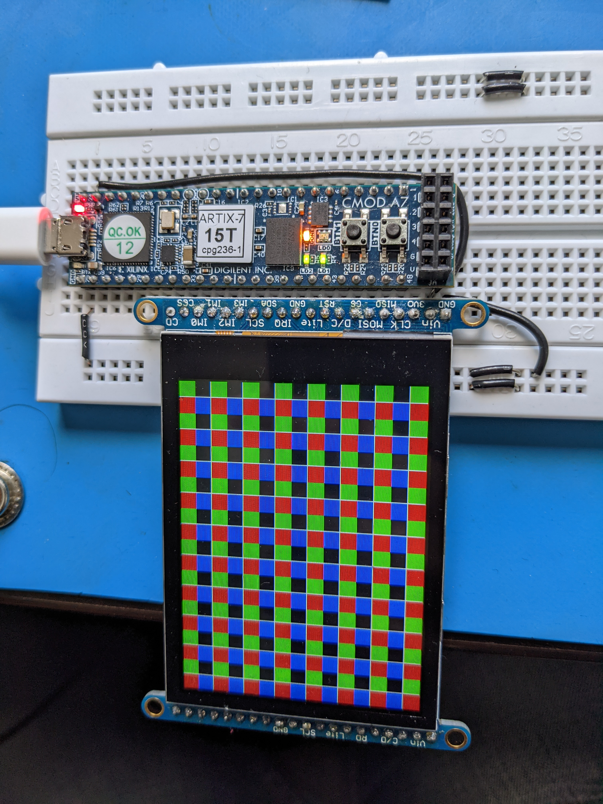

# Lab 2: Etch a Sketch - Update 3

In this lab we're going to build logic to make an "etch a sketch" or sketchpad hardware device. Over the course of the lab you will learn how to:
* Design your own specifications for complex sequential and combinational logic blocks.
* Implement controllers for the popular SPI and i2c serial interfaces.
* Learn how to interface with both ROM and RAM memories.
* Get better at 

We're using [Adafruit's 2.8" TFT LCD with Cap Touch Breakout Board w/MicroSD Socket](https://www.adafruit.com/product/2090). Through the course of the lab we'll interface with following components on the breakout board:
- a 240x320 RGB TFT Display
- an ILI9341 Display Controller [datasheet](https://cdn-shop.adafruit.com/datasheets/ILI9341.pdf)
- an FT6206 Capacitive Touch Controller [datasheet](https://cdn-shop.adafruit.com/datasheets/FT6x06+Datasheet_V0.1_Preliminary_20120723.pdf) and [app note](https://cdn-shop.adafruit.com/datasheets/FT6x06_AN_public_ver0.1.3.pdf)
- (stretch) an SD Card

## Lab Checklist

- [*] Pulse generator
- [*] PWM Module
- [*] SPI Controller for Display
- [ ] i2c Controller for touchscreen 

## Part 3
### a) Catch up from last time
This folder has a fully implemented display module. To make sure you are caught up please read through the `spi_controllers.v`, `ili9341_display_controller.sv`, and `main.sv` files.

You need to solder headers on to one side of the board, then clip it into your breadboard as shown here:

You should only need two jumpers, one for GND and one for VDD (goes into the VIN pin of the display).

Then modify something about the display pixel pattern in `ili9341_display_controller.sv` to change what the synthesized pattern looks like on the display, and call an instructor over to take a look!

### b) i2c controller

Your task is to implement an i2c_controller to talk to the FT6206 IC on our display. Use the references from today's lecture notes along with the datasheet and app note linked above to try to make this work!
While i2c is more of a standard than SPI, implementations vary and there are a lot of ways to tackle this. Rememeber that `spi_controller.sv` shows you how to do logic on negative or positive edges.

Make sure your implementation:
- [ ] Respects the `I2C_CLK_HZ` parameter (we want it to be 100kHz for the final implementation!)
- [ ] Uses the tristate to let the secondary device drive the `sda` line.
- [ ] (optional) implements a cooldown between transactions (very handy for debugging on a scope).

You should only have to edit `i2c_controller.sv` but please read through the other code to see what's going on! There's a (perhaps buggy) implementation of an FT6206 controller, which brings us to...

### c) Stretch Goal: FT6206 state machine
- Delete my code and use the `test_ft6206_controller` testbench to try to make your own FSM that can talk to the chip using your i2c controller!